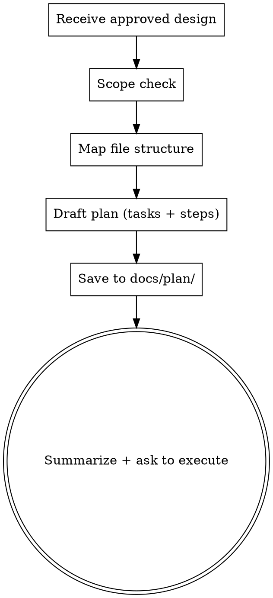

# Writing plans

## Plan must include
- A short goal.
- 3-7 concrete steps (file edits, new files, config changes).
- Tests or verification.
- Risks and fallback.

## Process flow

## Output
- Always write the plan into a markdown file under `docs/plan/`.
- File name format: `{dd-mm-yyyy}-{kebab-case-name}-plan.md` (example: `10-03-2026-api-cache-plan.md`).
- If `docs/plan/` does not exist, create it.
- The response should reference the created file and briefly summarize its contents.
- Hard stop after writing the plan: ask whether to continue in the current context or switch to a new context and use the created plan. Do not start implementation.

## Rules
- Avoid overly detailed micro-steps.
- If information is missing, ask 1-2 clarifying questions.
- Mention target files and direction of changes.

## Language
- Respond in Czech per the `czech-communication-standard` skill.
