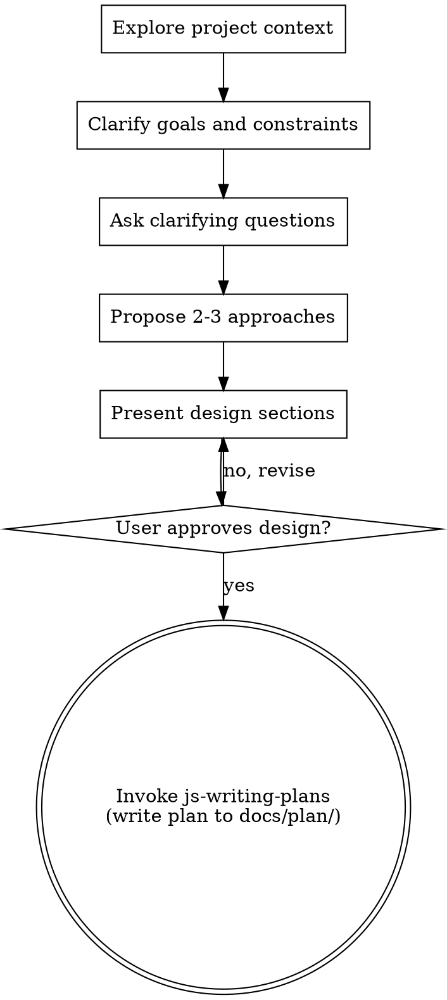

# JS brainstorming

## Purpose
Turn ideas into a clear JS/TS design and scope before any implementation.

## Non-negotiables
- Do not write code or make changes before a design is presented and approved.
- Ask only one question per message.
- Prefer multiple-choice questions when possible.
- Always propose 2-3 approaches with tradeoffs and a recommendation.
- Keep output in Czech per language rules.
- Hard stop after design approval: do not proceed to planning or implementation until the user explicitly approves switching to js-writing-plans.

## Checklist (in order)
1. Explore current project context (files, docs, recent changes).
2. Clarify goals and constraints (platform, framework, build, runtime).
3. Ask clarifying questions one at a time.
4. Propose 2-3 approaches with tradeoffs and your recommendation.
5. Present the design in sections scaled to complexity.
6. Ask for approval after each section.
7. Transition to `js-writing-plans` only after approval (the plan must be written to `docs/plan/`).

## Process flow

**Terminal state: invoke `js-writing-plans`.**
**Stop condition:** After the user approves the design, ask for explicit permission to switch to `js-writing-plans` and wait. Do not continue in the same turn.

## Process guidance
### Understanding the idea
- If the request spans multiple subsystems, surface it and decompose first.
- For appropriately scoped work, focus on purpose, constraints, success criteria.
- Keep scope tight; remove unnecessary features (YAGNI).

### Exploring approaches
- Lead with the recommended option and why.
- Compare complexity, risks, time, maintenance, and compatibility with the stack.

### Presenting the design
- Cover architecture, components, data flow, error handling, and testing.
- Keep each section short unless complexity requires more detail.
- Validate after each section and revise if needed.

### Design for clarity
- Define clear boundaries between modules.
- Ensure each unit has a single purpose and a well-defined interface.
- Avoid tangling responsibilities; keep files focused.

## Language
- Respond in Czech per the `czech-communication-standard` skill.
